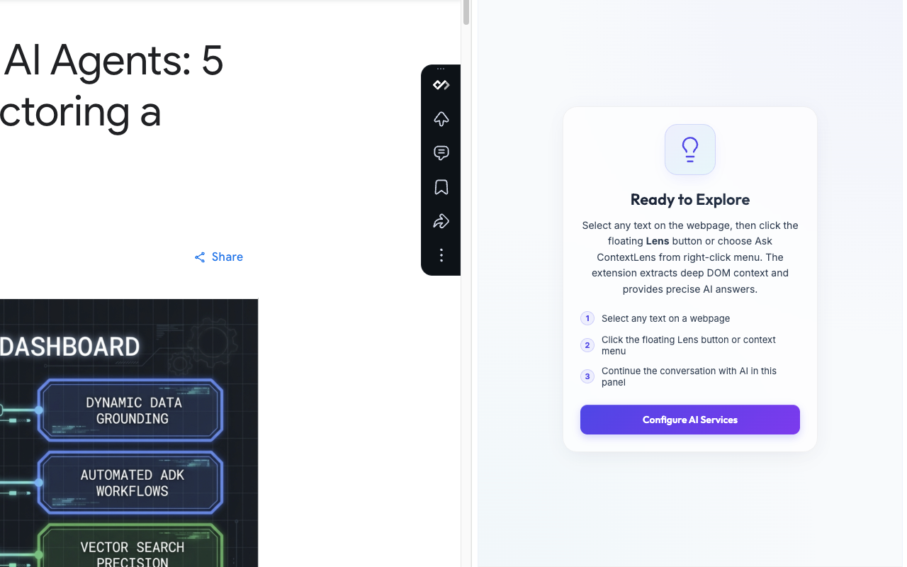
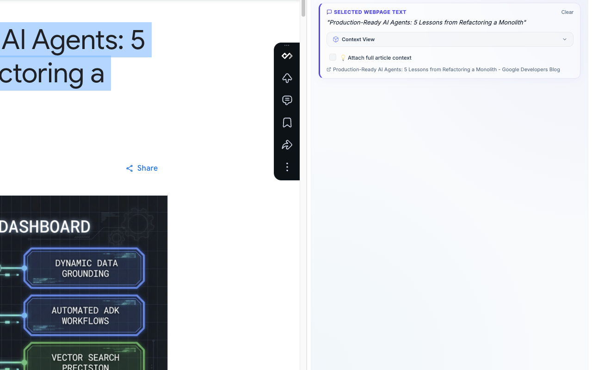
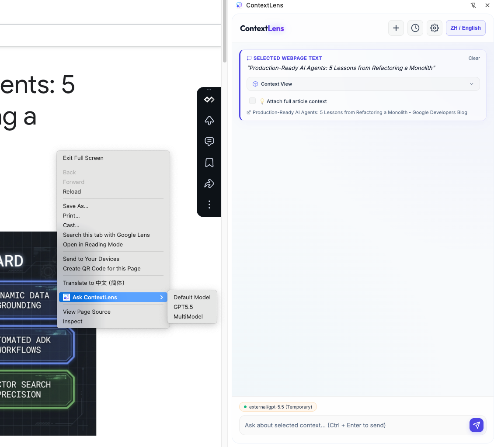
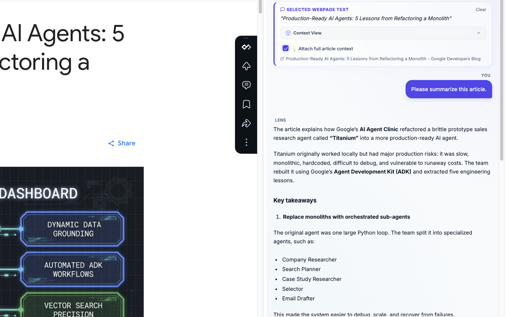
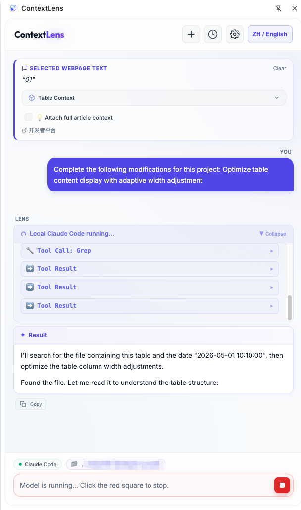

# ContextLens - Smart AI Side Panel Chrome Extension

ContextLens is a Chrome extension that lets you highlight text on any webpage and instantly interact with AI models in a side panel. It automatically captures deep DOM context around your selection (full code blocks, tables, surrounding paragraphs), with optional full-page article content, so the model can respond with accurate, context-rich answers.

It also supports **local CLI coding agents** (Claude Code, Codex CLI, Gemini CLI). Through the Bridge Server, selected UI text can be sent directly to your local agent, enabling a seamless workflow from "select text -> locate code -> apply changes".

---

## Core Features

- **Instant highlight trigger**: Select text on a webpage and a Lens button appears right next to the cursor.
- **Persistent side panel**: Built on Chrome Side Panel API, so conversation context is kept across tab switching.
- **Smart DOM context extraction**: Automatically detects code blocks (with language hint), tables (formatted as Markdown), heading hierarchy, context windows, semantic path, and image metadata.
- **Full-page context merge**: Optionally append the full article body (semantic extraction, cleanup, Markdown conversion) for complete background.
- **Long full-page extraction (50,000 chars)**: Increased the body extraction limit from `6,000` to `50,000`, making long docs and large source files fully usable for translation and summarization.
- **Right-click model routing (up to 5 pinned models)**: Pin frequently used models in settings, then launch "New Chat" with a specific model directly from right-click submenu.
- **Instant tooltip for pinned models**: Pure CSS tooltip with scale-pop animation and safe positioning to avoid clipping; pin icons smoothly transition to filled state.
- **Precise right-click image filtering**: Image parsing now runs only when right-clicking actual image elements (``, `<picture>`, `<figure>`), avoiding noisy false-positive image capture on normal text/container clicks.
- **Multi-provider API support**: Connect to Google Gemini, OpenAI, Anthropic Claude, and any OpenAI-compatible custom/local endpoints (Ollama, LM Studio, vLLM, etc.).
- **Local coding agents**: Via Bridge Server, connect Claude Code, Codex CLI, and Gemini CLI to locate and modify source code from selected UI text.
- **URL auto-switch rules**: Glob-style domain rule engine for automatic model and working-directory switching by site.
- **Rule modal editor**: Create and edit URL auto-switch rules in modal forms for cleaner interaction.
- **Tab-level isolation**: Each tab keeps its own chat history, selection context, and model state.
- **Real-time streaming output**: All models support SSE streaming; local agents additionally show logs, reasoning, and tool calls.
- **Interrupt while running**: Send button switches to a red stop button during request execution; click to cancel immediately (before first token or during streaming).
- **Model config modal improvements**: Switching provider automatically resets irrelevant fields; model sync success messages auto-dismiss.
- **Bilingual UI**: One-click `Chinese / English` switching in the side panel, including static and major dynamic messages.
- **Glassmorphism UI**: Frosted style with polished transitions, code highlighting, and breathing status indicators.

---

## Installation

### 1. Install the Chrome extension

This project uses Chrome Manifest V3 and is loaded as an unpacked extension:

1. Clone or download this repository.
2. Open `chrome://extensions/` in Chrome and enable **Developer mode**.
3. Click **Load unpacked** and select the project root (the folder containing `manifest.json`).
4. Pin ContextLens in the Chrome toolbar for the best experience.

### 2. Start Bridge Server (optional, required for local agents)

If you want to use Claude Code / Codex CLI / Gemini CLI local agents:

```bash
cd bridge
npm install
node server.js
```

Bridge Server runs at `http://localhost:3100` by default. The extension will auto-detect local agent availability.

---

## AI Configuration

1. Click the **Settings (gear)** button at the top of the side panel.
2. In **Basic Config**, manage models:
   - **Local agents**: Auto-detect installed CLI agents (Claude Code, Codex, Gemini), including availability and version. Click **Refresh Agents** to re-scan.
   - **API models**: Click **+ Add API Model** in model cards, choose provider (Gemini / OpenAI / Claude / Custom), and enter API key + model name. Custom API supports one-click model list sync.
   - **Form behavior**: When switching providers in the modal, non-applicable fields are automatically cleared/reset. Sync success message auto-hides after a short delay.
3. In **Auto-Switch Rules**, configure URL rules:
   - Create/edit rules with **Add Rule** or **Edit** on a rule card.
   - Fill name, URL pattern (`*` wildcard supported), target model, and CWD (for local agents).
   - Rules support priority sorting and enable/disable toggles.
4. Click **Save Configuration**. A green status indicator at the bottom means configuration is successful.

---

## Usage



### Method 1: Floating Lens button (recommended)

1. Highlight text on any webpage.
2. Click the floating `Lens` button near the selection to open side panel with extracted DOM context.
3. Optionally enable full-page context.
4. Enter your request and press Enter to send.



### Method 2: Right-click context menu

1. Select text on webpage (or right-click an element, including images and buttons).
2. Choose **Ask ContextLens** from context menu.
3. **Direct model routing from right-click menu**: If models are pinned in settings, right-click menu exposes a submenu for direct model selection, and starts a new chat with that temporary model.



### Local Agent mode

1. Ensure Bridge Server is running and at least one CLI agent is installed.
2. Select a local agent model in settings, or switch via URL rules.
3. Select UI text on webpage; ContextLens builds a code-location prompt template automatically.
4. Side panel renders agent output in three cards: **Input Context** -> **Execution Logs** (reasoning + tool calls) -> **Execution Result**.



#### Typical workflow: Apply web article ideas to local project

When reading a technical article, you can directly apply a code idea or fix into your local repository with ContextLens:

1. **Select web content**: Highlight relevant code or explanation in the article and click the floating `Lens` button.
2. **Attach full-article background (optional)**: Enable full-page context in side panel for richer background.
3. **Send a concrete coding instruction**: Example: "Refactor a method in `utils.js` in my local project based on this web logic."
4. **Auto-locate and patch code**: Local agent combines selection content, full-page content, and local workspace context to locate and update source files.



### Quick model switching

Click the status indicator at the bottom of side panel to open quick model panel:

- **Temporary Switch**: Temporary model switch for current tab only.
- **Create Domain Rule**: Quickly create auto-switch rule based on current page URL.

### UI language switching

Click the language button at the top-right corner of side panel to switch between `Chinese / English`. The preference is persisted and auto-restored.

---

## Project Structure

```text
ContextLens/
  manifest.json            # Chrome extension config (MV3)
  background.js            # Service Worker: side panel lifecycle, context menu, session routing
  content.js               # Content script: text selection, DOM extraction, floating button
  content.css              # Floating button styles
  sidepanel/
    sidepanel.html         # Side panel layout
    sidepanel.css          # Glassmorphism style system
    sidepanel.js           # Core logic: streaming interactions, rule engine, state persistence
  bridge/
    package.json           # Bridge Server config
    server.js              # Node bridge: agent detection, CLI dispatch, SSE forwarding
  icons/                   # Extension icon set
  referrence/              # Product screenshots
```

---

## Technical Details

### DOM context extraction

`content.js` extracts the following structured context around selected content:

| Context Type | Extraction Logic |
|---|---|
| Code Block | Walk up to `<pre>/<code>`, capture full content, detect language from `language-*` class |
| Table | Find parent `<table>` and convert to Markdown table |
| Heading | Scan previous `h1-h6` to determine section title |
| Text Window | Sliding window of 800 chars before and after selection |
| Images | Up to 5 images in selection (alt, dimensions, src) |
| Semantic Path | CSS breadcrumb like `main > article > section#content > p` |
| Full-page Body | Semantic main-content extraction (<= 50000 chars), cleanup + Markdown conversion |
| Meta | `<meta description>` and `og:description` |

### Bridge Server agent orchestration

| Agent | CLI Command | Output Format |
|---|---|---|
| Claude Code | `claude -p <prompt> --output-format=stream-json` | Stream JSON (`assistant` / `tool_use` / `result`) |
| Codex CLI | `codex exec --json -C <dir> <prompt>` | JSON (`agent_message` / `function_call` / `function_result`) |
| Gemini CLI | `gemini --output-format=stream-json <prompt>` | Stream JSON (`content` / `reasoning` / `tool_call`) |

### URL rule engine

Rule matching uses glob patterns, with specificity scoring and manual ordering:

1. **Temporary switch** (highest priority) - current tab only.
2. **URL rules** - matched in order, with more specific patterns preferred.
3. **Default model** - fallback when no rule matches.

### Streaming output parsing

All API endpoints use SSE streaming. Local agents also parse these event types:

- `assistant / agent_message / content` -> rendered as text
- `thinking / reasoning` -> rendered as collapsible reasoning blocks
- `tool_use / tool_call / function_call` -> rendered as system logs (with params)
- `tool_result / function_result / command_execution` -> rendered as system logs (with output)
- `error` -> rendered as error alerts

---

## Security and Privacy

- API keys are stored in `chrome.storage.local` only.
- Bridge Server runs locally at `localhost:3100` and is not exposed publicly.
- API requests are sent directly to model endpoints; ContextLens does not proxy your data through intermediate servers.

---

## License

MIT
