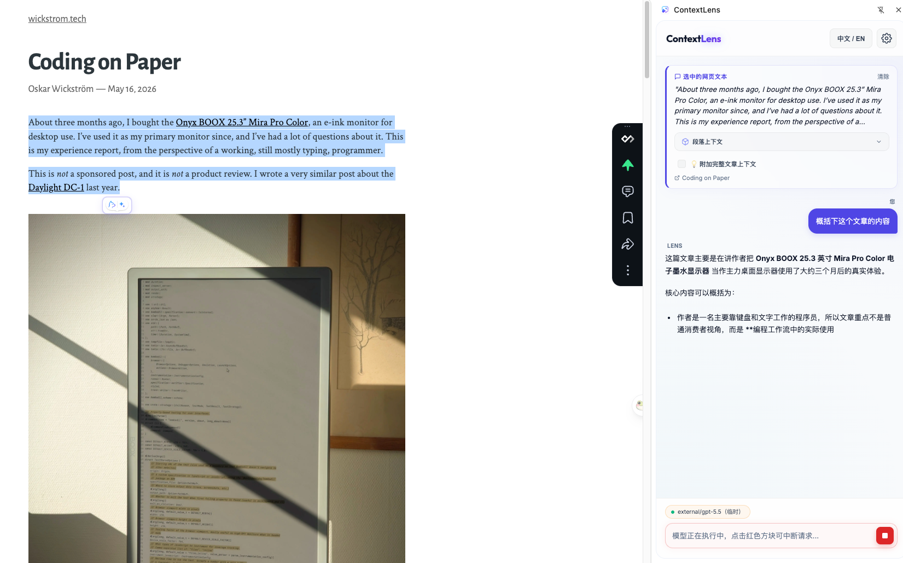
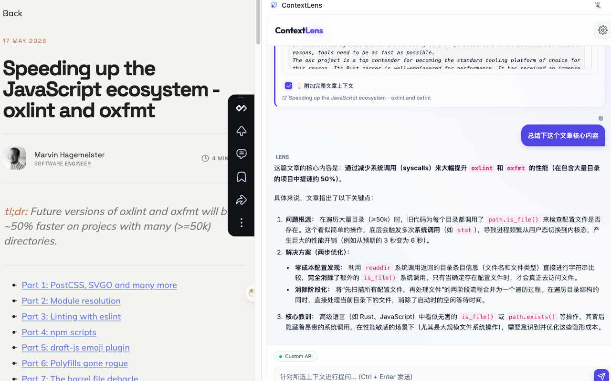
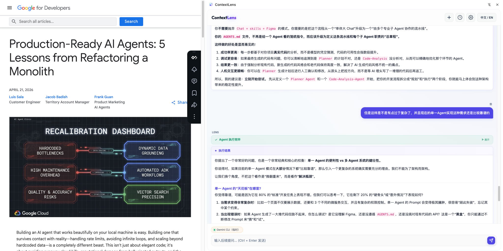

# ContextLens — 智能 AI 侧边栏 Chrome 插件

ContextLens 是一款 Chrome 浏览器插件，让您在任意网页上划词选中文本，即时在侧边栏中与 AI 大模型交互。插件自动抓取选中区域的深层 DOM 上下文（完整代码块、表格、上下段落），以及可选的整篇网页正文，帮助 AI 提供精准的深度解答。

同时支持 **本地 CLI 编程代理**（Claude Code、Codex CLI、Gemini CLI、Copilot CLI），通过 Bridge Server 将选中 UI 文本直接发送给本地代理，实现"选中 → 定位代码 → 自动修改"的开发闭环。

---

## 核心特性

- **即时选词唤醒**：选中网页文本，光标旁立即浮现 Lens 按钮，点击载入侧边栏触发对话。
- **常驻侧边栏**：基于 Chrome Side Panel API，切换标签页时对话上下文依然保留。
- **智能 DOM 上下文提取**：自动检测选区所属的代码块（含语言标识）、表格（Markdown 格式化）、标题层级、前后文窗口、页面语义路径、图片元信息。
- **全页上下文融合**：一键勾选附加整篇网页正文（语义解析、去噪、Markdown 化），为 AI 提供完整背景。
- **超长全页正文提取升级 (50,000 字符)**：将正文抓取上限从 `6,000` 提升至 `50,000` 字符，能完完整整装下长文档与巨幅源码，扫清全文翻译、长内容总结的截断障碍。
- **右键自定义模型直达 (最多5个)**：支持在设置卡片中为任意可用模型打下图钉置顶，右键点击通过二级子菜单直接指定模型发起 New Chat 提问，实现直截了当的模型分流。
- **自定义图钉即时 Tooltip 提示**：使用纯 CSS 伪元素实现无延迟、气泡缩放弹出（Scale-Pop）、避开滚动条裁剪的即时 Tooltip；置顶后图钉 icon 自动过渡为实心填充状态。
- **精准右键图像相交/包裹过滤**：重构右键元素图片提取算法。只有当右键直接选中 ``、`<picture>` 或 `<figure>` 等图片元素时才激活图片解析，右键点击普通文本或大容器时不再误抓取背景装饰图，消除无选区右键误勾选图片解析的视觉噪音。
- **多模型 API 支持**：直连 Google Gemini、OpenAI、Anthropic Claude 官方 API，以及兼容 OpenAI 规范的自定义 / 本地 API（Ollama、LM Studio、vLLM 等）。
- **本地编程代理**：通过 Bridge Server 对接 Claude Code、Codex CLI、Gemini CLI、Copilot CLI，选中 UI 文本即可让本地代理定位源码并执行修改。
- **URL 自动切换规则**：基于 glob 通配符的域名规则引擎，自动为不同网站切换模型和代理工作目录。
- **规则弹窗编辑**：新增/编辑 URL 自动切换规则统一使用弹窗表单，不再在规则列表底部展开编辑区，交互更聚焦。
- **标签页隔离**：每个标签页独立维护聊天历史、选区上下文和模型状态，互不干扰。
- **实时流式输出**：所有模型均支持 SSE 流式响应，本地代理额外展示执行日志、思考过程和工具调用。
- **运行中可中断**：模型请求进行中时，发送按钮自动切换为红色方块中断按钮；点击可立即终止请求（支持等待首包和流式阶段）。
- **模型配置弹窗优化**：新增/编辑模型时切换 Provider 会自动重置无关字段，避免残留 Custom 配置；模型同步成功提示会自动消失。
- **中英文双语界面**：侧边栏右上角支持 `中文 / English` 一键切换，覆盖静态文案与主要动态状态文案。
- **磨砂玻璃设计**：Glassmorphism 美学规范，折叠动画、代码高亮、状态呼吸灯。

---

## 安装指南

### 1. 安装 Chrome 插件

基于 Chrome Manifest V3，以已解压的扩展程序加载：

1. 克隆或下载本项目到本地。
2. Chrome 地址栏输入 `chrome://extensions/`，开启 **开发者模式**。
3. 点击 **加载已解压的扩展程序**，选择项目根目录（包含 `manifest.json` 的文件夹）。
4. 在 Chrome 工具栏将 ContextLens **固定 (Pin)** 以获得最佳体验。

### 2. 启动 Bridge Server（可选，本地代理功能需要）

如需使用 Claude Code / Codex CLI / Gemini CLI / Copilot CLI 本地代理功能：

```bash
cd bridge
npm install
node server.js
```

Bridge Server 默认运行在 `http://localhost:3100`，插件会自动探测本地代理可用性。

---

## AI 配置

1. 点击侧边栏顶部的 **设置 (齿轮)** 按钮。
2. 在 **Basic Config** 标签页中管理模型：
   - **本地代理**：自动检测已安装的 CLI 代理（Claude Code、Codex、Gemini、Copilot），显示可用状态和版本。点击 **Refresh Agents** 重新探测。
   - **API 模型**：点击模型卡片列表中的 **+ Add API Model**，选择 Provider（Gemini / OpenAI / Claude / Custom），输入 API Key 和模型名称。Custom API 支持 Sync 按钮一键拉取可用模型列表。
   - **表单行为**：在模型弹窗中切换 Provider 时，会清空并重置当前 Provider 不适用的字段；同步成功提示会在短时间后自动收起。
3. 在 **Auto-Switch Rules** 标签页中配置 URL 规则：
   - 创建/编辑规则：点击 **Add Rule** 或规则卡片的 **Edit** 后，使用弹窗填写名称、URL 模式（支持 `*` 通配符）、目标模型、CWD 工作目录（本地代理专用）。
   - 规则按优先级排序，支持启用 / 禁用开关。
4. 点击 **Save Configuration** 保存。侧边栏底部状态灯转绿即代表配置成功。

---

## 使用方法



### 方式一：浮动 Lens 按钮（推荐）

1. 在网页上划词选中文本。
2. 选区旁浮现 `Lens` 按钮，点击打开侧边栏并载入 DOM 上下文。
3. 如需附加整篇网页正文，勾选 `附加完整文章上下文`。
4. 在输入框中输入诉求，回车发送。



### 方式二：右键上下文菜单

1. 选中网页文本（或右键点击任意元素，包括图片、按钮）。
2. 右键选择 **Ask ContextLens**，侧边栏自动载入上下文。
3. **右键直达特定模型（置顶分流）**：如果在设置中置顶（Pin）了模型，右键菜单将展开二级菜单，支持直接选择该模型提问。点击后会自动以当前临时选择的模型开启全新对话（New Chat），实现无缝分流。

### 本地代理模式

1. 确保 Bridge Server 已启动，且至少一个 CLI 代理已安装。
2. 在设置中选中本地代理模型，或通过 URL 规则自动切换。
3. 选中网页上的 UI 文本，插件自动构建定位源码的 Prompt 模板。
4. 侧边栏以三段卡片展示代理输出：**输入上下文** → **执行日志**（含思考、工具调用） → **执行结果**。

#### 典型应用案例：结合网页文章与本地项目

当您在阅读一篇技术文章时，希望将文章中的特定代码逻辑或修复思路直接应用到您的本地项目中，ContextLens 能够实现完美无缝的无缝对接：
1. **选中网页内容**：在网页文章中划词选中相关的代码块或思路说明，点击浮动 `Lens` 按钮。
2. **附带整篇文章背景**（可选）：勾选侧边栏的“附加完整文章上下文”以提供更全面的环境背景。
3. **结合本地代理下达指令**：在聊天输入框中输入具体任务（例如：“参考这段网页逻辑，重构本地项目中的 `utils.js` 里的某个方法”）。
4. **代码自动定位与修改**：本地代理将同时结合“当前选区内容”、“整篇文章内容”以及“本地项目工作区”进行智能分析，自动定位本地源码，并精准执行重写与验证。



### 快捷模型切换

点击侧边栏底部的状态灯，弹出模型快捷面板：
- **Temporary Switch**：仅当前标签页临时切换模型。
- **Create Domain Rule**：基于当前页面 URL 快速创建自动切换规则。

### 界面语言切换

点击侧边栏右上角语言按钮可在 `中文 / English` 间切换。语言设置会持久化保存，下次打开侧边栏时自动恢复。

---

## 项目结构

```
ContextLens/
  manifest.json            # Chrome 插件配置 (MV3)
  background.js            # Service Worker：侧边栏生命周期、右键菜单、会话传递
  content.js               # 内容脚本：划词检测、DOM 上下文提取、浮动按钮
  content.css              # 浮动按钮样式
  sidepanel/
    sidepanel.html          # 侧边栏布局
    sidepanel.css           # 磨砂玻璃美学规范 (2700+ 行)
    sidepanel.js            # 核心逻辑：多端点流式交互、规则引擎、状态持久化
  bridge/
    package.json            # Bridge Server 配置
    server.js               # Node.js 桥接：代理探测、CLI 调度、SSE 流转发
  icons/                    # 插件图标集
  referrence/               # 产品截图
```

---

## 技术细节

### DOM 上下文提取

content.js 在选区周围提取以下结构化信息：

| 上下文类型 | 提取逻辑 |
|---|---|
| 代码块 | 向上查找 `<pre>/<code>`，提取完整内容并检测语言（`language-*` 类名） |
| 表格 | 查找 `<table>` 父元素，格式化为 Markdown 表格 |
| 标题 | 向前扫描 `h1-h6`，获取所属章节标题 |
| 文本窗口 | 提取选区前后各 800 字符的滑动窗口 |
| 图片 | 提取选区内最多 5 张图片的元信息（alt、尺寸、src） |
| 语义路径 | 构建如 `main > article > section#content > p` 的 CSS breadcrumb |
| 全页正文 | 语义选择器提取主内容（≤50000 字符），去噪后 Markdown 化 |
| Meta 信息 | 读取 `<meta description>` 和 `og:description` |

### Bridge Server 代理调度

| 代理 | CLI 命令 | 输出格式 |
|---|---|---|
| Claude Code | `claude -p <prompt> --output-format=stream-json` | Stream JSON (assistant / tool_use / result) |
| Codex CLI | `codex exec --json -C <dir> <prompt>` | JSON (agent_message / function_call / function_result) |
| Gemini CLI | `gemini --output-format=stream-json <prompt>` | Stream JSON (content / reasoning / tool_call) |
| Copilot CLI | `copilot --output-format json --stream on -p <prompt>` | JSON stream (agent_message / tool events) |

### URL 规则引擎

规则匹配采用 glob 通配符模式，优先级通过特异性评分和手动排序双重控制：

1. **临时切换**（最高优先级）—— 仅当前标签页生效。
2. **URL 规则** —— 按排序顺序匹配，更具体的模式优先。
3. **默认模型** —— 无规则匹配时回退。

### 流式输出解析

所有 API 代理均使用 SSE 流式传输，本地代理额外解析以下事件类型：

- `assistant / agent_message / content` → 渲染为文本
- `thinking / reasoning` → 渲染为可折叠思考过程
- `tool_use / tool_call / function_call` → 渲染为系统日志（含参数）
- `tool_result / function_result / command_execution` → 渲染为系统日志（含输出）
- `error` → 渲染为错误提示

---

## 安全与隐私

- 所有 API 密钥存储在 `chrome.storage.local`，不经过任何中间服务器。
- Bridge Server 仅运行在本地 `localhost:3100`，不暴露到外网。
- API 请求点对点直连大模型端点，插件本身不转发任何数据。

---

## License

MIT
