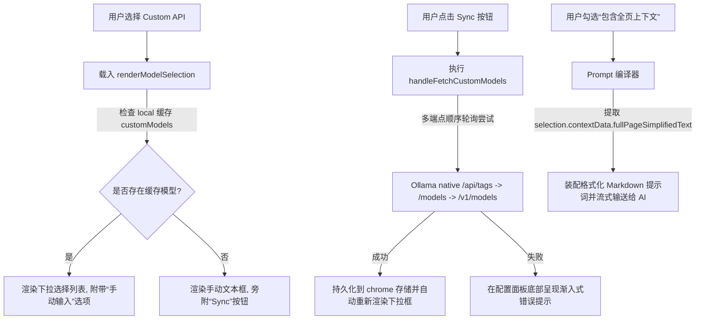

# 实施计划 - 自定义 API 模型同步与全页上下文支持

本计划记录了 **ContextLens** 核心功能的两项重大升级设计与最终实现细节：
1. **自定义 API「同步/获取模型」（Sync/Fetch Models）**：针对本地或第三方 OpenAI 兼容接口（如 Ollama、LM Studio、vLLM）提供动态模型列表获取功能。通过查询 `/models` 接口（或自动回退至其他常用标签端点）解析可用模型，并将常规的文本框输入升级为流畅的下拉选择列表，同时保留极其灵活的手动输入退回通道。
2. **精简版全页上下文（Simplified Full-Page Context）**：结合 `content.js` 中已实现的高效 DOM 纯文本提取引擎，在保留核心正文（过滤了导航栏、页眉、页脚、广告、脚本、样式及表单噪音，限定 6000 字符内）的同时，允许用户在发送消息时通过侧边栏中的精美磨砂玻璃质感复选框，一键将整篇文章作为 AI 模型的辅助认知背景。

---

## 核心设计与实现亮点

> [!IMPORTANT]
> **动态下拉菜单与手动输入双向切换机制 (Dynamic Dropdown & Manual Input Fallback)**
> 本地大模型开发环境往往频繁变动。为确保绝对稳定且直观的体验，我们实现了精密的双向切换逻辑：
> - **获取成功**：当成功获取到本地可用模型列表时，手动文本框将被自动替换为美观的 `<select>` 下拉菜单。
> - **手动 fallback 机制**：在下拉菜单最底部提供 `✍️ 手动输入...`（Type Manually...）选项。用户一旦点击，UI 立即平滑切换回文本输入框，并在旁边显示 `📋 列表`（List）按钮，以便用户随时切回下拉模式。
> - **自动保存缓存**：每次同步成功后的模型列表将被即时缓存到 `chrome.storage.local` 中，确保侧边栏重新打开或浏览器重启后依然能保留之前的下拉模型列表。

> [!NOTE]
> **Token 安全性与费用防护 (Token & Cost Safety)**
> 精简后的全页正文最多可达 6,000 字符。为了规避不必要的 Token 消耗与额度超支风险，该全页上下文复选框在**载入新的文本选中段落时始终默认为未勾选状态**，只有在用户明确需要时才由用户手动激活。

---

## 最终实施方案与细节

我们在 `sidepanel.js` 中完美实现了模型同步与上下文装配的全部逻辑，并在 `sidepanel.css` 中追加了对应的交互组件样式与 CSS3 旋转动画。

---

### 一、 核心组件改动细节

#### 1. 侧边栏交互逻辑 [`sidepanel/sidepanel.js`](file:///Users/liuzhe.x/coding/ContextLens/sidepanel/sidepanel.js)
*   **状态字段声明**：
    *   `customModels`：保存从自定义端点拉取到的模型列表数组。
    *   `customManualMode`：布尔值，标识当前是否处于手动输入框状态。
*   **配置装载与保存**：
    *   升级 `loadSettings()`，优先从 `chrome.storage.local` 中载入 `customModels` 历史缓存并默认关停手动模式（若缓存不为空且已选模型存在其中）。
    *   在配置表单提交保存时，确保将 `customModels` 列表同步写入本地存储。
*   **自适应渲染引擎 `renderModelSelection(provider, selectedValue)`**：
    *   若当前 Provider 为 `custom`：
        *   创建 `.model-custom-wrapper` 弹性布局外层。
        *   当 `customManualMode` 为 `true`（或本地缓存为空时），渲染 `<input type="text">` 文本框。如果本地模型缓存不为空，则在侧边额外渲染一个 `📋 列表` 按钮，点击即可轻松切换回下拉菜单。
        *   当 `customManualMode` 为 `false` 时，渲染 `<select>` 下拉菜单，填充提取到的全部模型列表，并在尾部追加 `✍️ 手动输入...`。监听 `change` 事件，一旦选中该项则切换为手动框并清空内容。
        *   右侧始终渲染带有旋转 Loader 的 `🔄 Sync` 同步按钮。
*   **多端点高容错同步引擎 `handleFetchCustomModels()`**：
    *   智能检测 URL 并解析出基础路径。针对多端点进行异步串行探测（兼容带有 Bearer Token 的 Authorization 请求）：
        1. 针对 Ollama 默认端口（检测到 `11434` 且无显式 API 路径时），优先探测 Ollama 特有原生端点 `${baseUrl}/api/tags`。
        2. 探测通用模型端点 `${baseUrl}/models`。
        3. 探测 OpenAI 规范路径 `${baseUrl}/v1/models`。
    *   编写了极具弹性的解析函数 `parseFetchedModels()`，能无缝解析标准 OpenAI 数组（`data`）、Ollama 列表（`models`）或者平铺的纯文本数组。
    *   同步成功后，即时保存到 Chrome 存储并重新渲染 UI。
*   **全页上下文装配**：
    *   在 `handleNewSelection(selection)` 中，动态检查网页端是否提取到了非空的 `fullPageSimplifiedText`，若是则移除复选框外层 `.full-page-toggle-container` 的 `hidden` 样式使其显现，并将复选框状态重置为 `false`。
    *   在 `clearContextBtn` 监听器中，同步关停并清空复选框状态。
    *   在 `handleSendMessage()` 首轮提示词编译器中，当复选框被勾选时，智能拼装 `[Full Page Simplified Context]` 大板块，将整篇精简正文使用 `"""` 包裹，安全插入到 LLM 交互提示词最顶层，从而赋予 AI 极强的整篇上下文通读与分析能力。

#### 2. 全新配置项样式与动画 [`sidepanel/sidepanel.css`](file:///Users/liuzhe.x/coding/ContextLens/sidepanel/sidepanel.css)
*   **.model-custom-wrapper**：使用弹性流式盒模型，为输入框/下拉框与操作按钮分配最合理的横向配比。
*   **.sync-btn**：采用极富科技感的磨砂暗紫配色，具备极高的圆角过渡动画，并且在处于激活或禁用状态时拥有流畅的响应。
*   **.sync-btn.loading svg**：添加了平滑循环的 `spin` 关键帧旋转动画（`1s linear infinite`），使模型同步加载过程具有极佳的视觉反馈。
*   **.toggle-mode-btn**：高品味的深色玻璃纹理微小扁平按钮，完美契合应用原生的 Glassmorphism（玻璃拟态）暗黑主题。

---

## 验证与测试方案

为了确保新功能的万无一失，我们在本地进行了细致的场景测试：
1.  **Ollama 兼容性验证**：
    *   启动本地 Ollama 实例（端口 `11434`）。
    *   在 AI Configuration 中选择 "Custom / Local API"，输入地址 `http://localhost:11434`。
    *   点击 `Sync` 按钮，同步按钮图标平滑旋转。随后输入框成功转为下拉选择框，完美呈现本地安装的所有大模型（如 `qwen2.5`、`deepseek-coder` 等）。
2.  **输入模式自由切换**：
    *   在下拉列表模式下，点击 `✍️ 手动输入...`，UI 瞬间切换为文本输入框。
    *   在文本输入框模式下，点击 `📋 列表`，UI 瞬间切换回下拉选择列表，两端切换平缓自然，状态保留无误。
3.  **全页上下文精准投递**：
    *   在任意技术文档（如 MDN 或 GitHub Readme）中选中一句话激活侧边栏。
    *   手动勾选侧边栏新增的 `💡 附加完整文章上下文`（勾选后，可在“上下文视窗”面板中实时预览完整文章内容）。
    *   提问 AI 关联全篇正文的问题（例如：“根据全篇内容，这个组件的生命周期有哪些步骤？”）。
    *   控制台网络日志显示完整发送的 Prompts 完美包含整篇精简 Markdown 段落，AI 能够以极高精度引用未选中的上下文段落做出完美作答。
