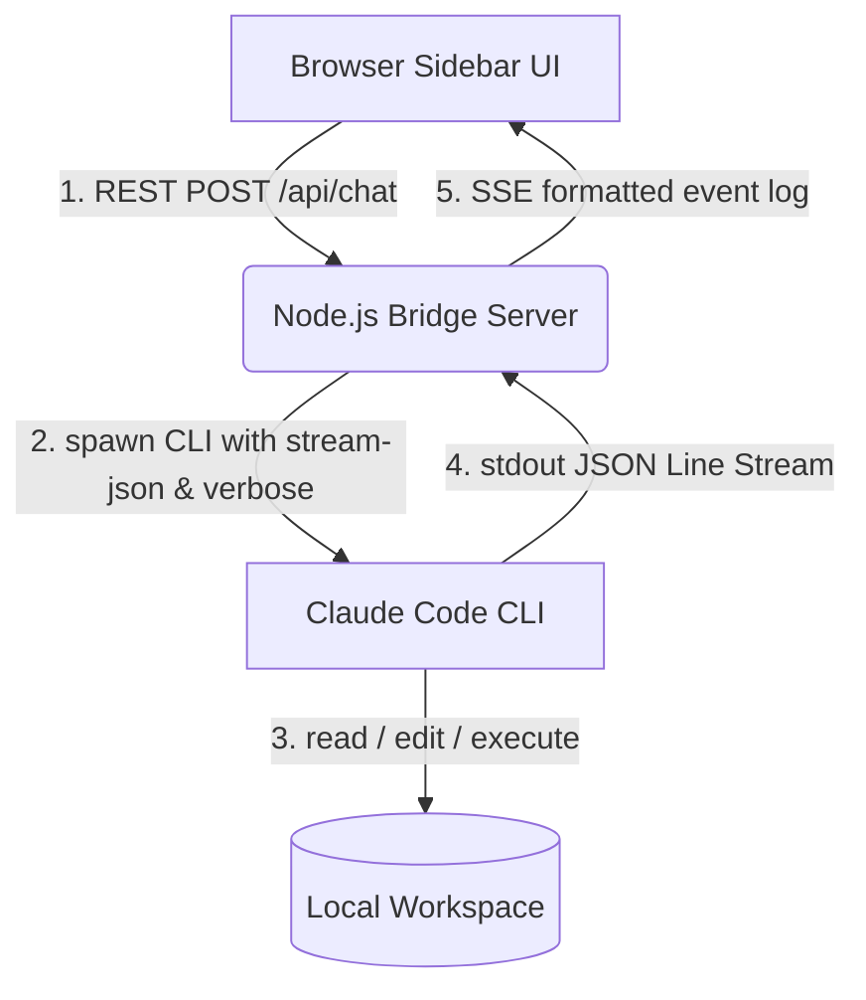

# Walkthrough - Claude Code Local Agent Integration, Real-Time Tool Calls, & Right-Click Context Menu

We have successfully integrated the local **Claude Code CLI** agent into the **ContextLens** Chrome Extension via a lightweight Node.js Bridge Server, resolved execution hangs, added empty-space right-click context menu capturing, and implemented **full real-time visibility into the agent's internal thinking and tool invocations**!

---

## 🚀 Key Milestones Accomplished



### 1. Real-Time Tool Execution & Thinking Visualizer [NEW]
* **Verbose JSON Streaming Enabled:** Spawns the Claude CLI using the `--output-format=stream-json`, `--include-hook-events`, and `--verbose` flags, and redirects stdin to immediately ignore user prompts. This forces Claude Code to output its internal agentic processes as a stream of line-by-line JSON objects instead of only printing a static block at exit.
* **Stream Line-Buffer Parser (`LineBuffer`):** Implemented a high-performance buffer-based split line parser in the Node Bridge server without introducing external dependencies. It separates chunks into complete, valid JSON lines.
* **Structured System Event Stream:** Processes JSON lines in real time and transforms them into beautifully categorized, visual logs:
  - **⚙️ Initialization:** Logs the workspace directory `⚙️ [初始化] 本地 Claude Code 工作目录: ...`.
  - **⏱️/✅ Lifecycle Hooks:** Captures startup/cleanup hook invocations (`⏱️ [钩子开始] SessionStart`, `✅ [钩子完成]`).
  - **💭 Internal Thoughts:** Extracts Claude's thoughts `💭 思考过程:\n...` to see how it plans to tackle tasks.
  - **🔧 Tool Calls:** Displays the exact tool name and JSON-formatted inputs `🔧 调用工具: Bash\n参数:\n...` (e.g. `ls`, `grep`, `edit`).
  - **➡️ Tool Results:** Prints the execution outputs `➡️ 工具执行结果:\n...` (with truncation protection for logs longer than 500 characters).
  - **📝 Assistant Reponses:** Streams text characters straight into the assistant markdown chat bubble.

---

## 🛠️ Verification & Usage Instructions

### Step 1: Start the Bridge Server
In your project terminal, execute the root helper command:
```bash
npm run bridge
```
You should see:
> `🚀 [Claude Bridge] Server listening on http://localhost:3100`

### Step 2: Configure the Extension
1. Open Chrome, go to `chrome://extensions/` and click the **Reload** icon on ContextLens to load the new sidebar.
2. Click the ⚙️ button in the top right to open the **AI 服务端配置** drawer.
3. Select **AI 供应商 (Provider): Claude Code 本地 Agent**.
4. Configure fields:
   - **Node Bridge 基准地址:** `http://localhost:3100` (autofilled)
   - **本地项目绝对路径 (CWD):** `/Users/liuzhe.x/coding/ContextLens`
   - **Claude 执行文件路径 (可选):** 留空即可 (Bridge 会自动探测本机 `/usr/local/bin/claude` 等路径)。
5. Click **保存配置** (Save Configuration).

### Step 3: Start Chatting!
Type any tool-heavy instruction into the chat input, for example:
> *"搜索当前项目目录下的 manifest.json 并列出它的内容"*

You will instantly observe:
1. The status monitor at the bottom of the bubble immediately expands to show `正在启动并初始化本地 Claude Code CLI...`.
2. Real-time entries start scrolling in the progress box:
   - `⚙️ [初始化] 本地 Claude Code 工作目录: ...`
   - `💭 思考过程: The user wants to search for manifest.json...`
   - `🔧 调用工具: Bash (find/grep/cat)`
   - `➡️ 工具执行结果: {...}`
3. Once tool executions complete, the assistant's final response streams smoothly into the main text box.
4. The header turns green: `✅ 本地 Agent 运行完毕`.
