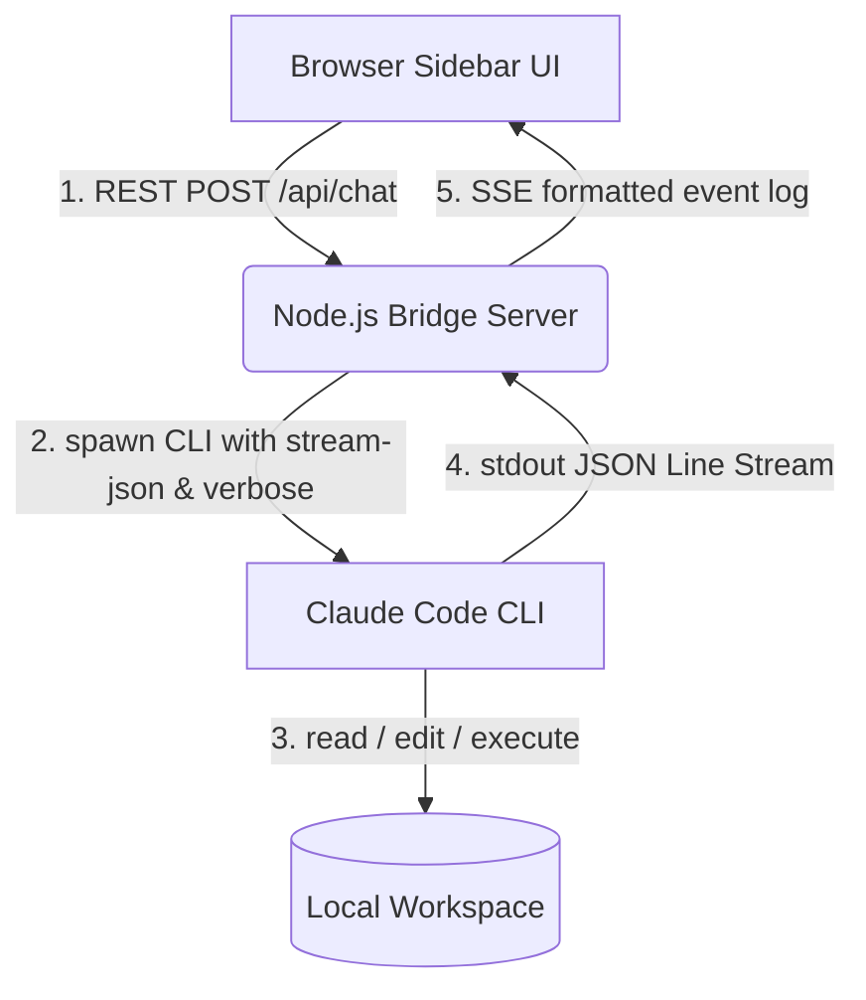

# Walkthrough - Claude Code Local Agent Integration, Real-Time Tool Calls, & Right-Click Context Menu

We have successfully integrated the local **Claude Code CLI** agent into the **ContextLens** Chrome Extension via a lightweight Node.js Bridge Server, resolved execution hangs, added empty-space right-click context menu capturing, and implemented **full real-time visibility into the agent's internal thinking and tool invocations**!

Additionally, we have refactored the model configuration in basic settings into a gorgeous **interactive model list**, added support for **adding custom models/local agents** (such as `codex-agent`, `deepseek-chat`, etc.) and deleting them dynamically, and removed the redundant URL-matching banner from the UI.

---

## 🚀 Key Milestones Accomplished



### 1. Interactive Model Config List & Add/Delete Custom Models [NEW]
* **Refactored Model Dropdown to Interactive List:** Removed the old `<select id="api-model">` in the basic settings. The configuration page now displays a scrollable, modern, and beautiful list showing all default and custom-added models for the currently active provider.
* **Dynamic Custom Models Addition:** Added a `➕ 添加` button in the top-right of the model section. Clicking it triggers prompt dialogs to easily specify any model ID (e.g. `codex-agent`, `deepseek-chat`) and display name.
* **Caches & Storage Persistence (`addedProviderModels`):** Custom-added models are cached and stored in local extension storage under `addedProviderModels` per provider. A seamless backward compatibility layer migrates existing OpenAI/Ollama synced `customModels` into the new structure on startup.
* **Interactive Model Actions:**
  - Selecting any list item highlights it immediately, registers it as active, and persists it when saving configurations.
  - Custom added models display a small trash button. Clicking it deletes the custom model, updates local storage, and falls back to default options gracefully.
* **Sync Rules Integration:** Custom added models appear dynamically inside the rule editor model dropdown list in Tab 2, ensuring they can be mapped to URL auto-switching rules.

### 2. URL-Based Auto-Switching Rules & Banner Streamlining [NEW]
* **Cleaned Up Redundant Banner:** Removed the redundant `#rule-match-banner` ("已按 URL 匹配规则: XXX") displayed above the chat input box. The status pill at the very bottom of the sidebar already indicates the active model and workspace in real time, making the banner unnecessary.
* **Dynamic Active Tab Monitoring:** Listens to `chrome.tabs.onActivated` and `chrome.tabs.onUpdated` in the background sidepanel initialization, querying the active tab URL.
* **Glob Wildcard Matcher (`matchUrlPattern`):** Evaluates URLs against user-defined rules. Supports wildcard asterisks `*` (e.g. `*github.com/cola-sk/context-lens*`) and performs robust case-insensitive substring fallback searches if no wildcards are present.
* **Transient Memory Overrides:** Seamlessly overrides the active AI provider, model, and local CWD settings in memory when a rule is matched.
* **Automatic Graceful Fallback:** Smoothly restores the user's manual/default settings drawer options when navigating to non-matching web pages.
* **Setting Drawer Tabbed Rules Manager:** Adds Tab 1 (`基本配置` - Defaults) and Tab 2 (`自动切换规则` - Rules Manager) to the drawer, allowing users to:
  - Add and Edit rules via a beautiful slide-down editor panel.
  - Reorder rules to prioritize specific matching rules (precedence moves up/down).
  - Toggle rule activation switches.
  - Delete rules easily.

---

## 🛠️ Verification & Usage Instructions

### Step 1: Start the Bridge Server
In your project terminal, execute the root helper command:
```bash
npm run bridge
```
You should see:
> `🚀 [Claude Bridge] Server listening on http://localhost:3100`

### Step 2: Configure the Extension
1. Open Chrome, go to `chrome://extensions/` and click the **Reload** icon on ContextLens to load the new sidebar.
2. Click the ⚙️ button in the top right to open the **AI 服务端配置** drawer.
3. Select **AI 供应商 (Provider): Claude Code 本地 Agent**.
4. Configure fields:
   - **Node Bridge 基准地址:** `http://localhost:3100` (autofilled)
   - **本地项目绝对路径 (CWD):** `/Users/liuzhe.x/coding/ContextLens`
   - **Claude 执行文件路径 (可选):** 留空即可 (Bridge 会自动探测本机 `/usr/local/bin/claude` 等路径)。
5. Click **保存配置** (Save Configuration).

### Step 3: Verify the Interactive Models List & Custom Additions
1. Open the drawer tab `基本配置` (Defaults).
2. Look at the **模型配置 (Models)** section. All models (e.g., `Gemini 2.5 Flash`, `Gemini 2.5 Pro` if Gemini is selected) are listed in a modern list with custom scrollbars and icons.
3. Click the `➕ 添加` button in the top-right of the models group.
4. Input a custom model identifier: `codex-agent`.
5. Input a display label: `Codex Local Agent`.
6. See `Codex Local Agent` immediately added to the list, highlighted as active, and selected.
7. Click the small trash icon next to `Codex Local Agent` to delete it. Note how selection gracefully falls back to the default models.
8. Add it back, click **保存配置**, and verify the bottom status bar pill updates to show `codex-agent` successfully!

### Step 4: Configure & Verify URL Auto-switching Rules
1. Open the sidebar and click the ⚙️ icon in the top right to open the **AI 服务端配置** drawer.
2. Select the **自动切换规则** tab at the top of the drawer.
3. Click the **➕ 添加新规则** button.
4. Fill in the sliding form:
   - **规则名称:** `ContextLens Workspace`
   - **URL 匹配规则 (支持 *):** `*github.com/cola-sk/context-lens*`
   - **AI 供应商:** `Claude Code 本地 Agent`
   - **工作区绝对路径 (CWD):** `/Users/liuzhe.x/coding/ContextLens`
5. Click **保存规则** to save the rule. You can toggle the active switch or move the rule up/down to adjust precedence.
6. Now open a browser tab to `https://github.com/cola-sk/context-lens`.
7. You will instantly see the bottom status bar pill transition to **Claude Code 本地 Agent** / `claude-code` and display the matching workspace CWD! No redundant rule-matched banner cluttering the UI will show up.
8. Open `google.com` (a non-matching tab). The bottom status pill will smoothly revert back to your previous default configuration.

---

### 3. Chat Styling & Input Visibility Fix [NEW]
* **Resolved Nesting Issue:** Fixed a bug in `sidepanel.html` where a missing `</div>` tag for `#settings-drawer` caused `<footer class="app-footer">` to be nested *inside* the drawer container. Since `#settings-drawer` has `.hidden` applied by default, this structure completely hid the chat input box.
* **Restored Classic Flexbox Layout:** Closed the drawer properly before the footer, making the footer a direct child of the `.app-container`. This fully restores the standard layout (Header -> Scrollable Chat -> Pinned Bottom Input Area) and ensures the input box is always visible and functional.

### 4. Claude Code Output Rendering and Separator Resilience [NEW]
* **Resolved Swallowed Event Types:** In `bridge/server.js` (`processStdoutLine`), added explicit parsing and streaming of `json.type === 'result'` and `json.type === 'error'` event packets from the Claude Code CLI's JSON stream. This stops the server from silently ignoring the final answer returned in `json.result`.
* **Flexible Regex Separation:** Inside `sidepanel.js` (`splitAgentOutput`), changed the exact string matching of `"3. Verify your changes..."` to a robust case-insensitive regular expression with flexible whitespace handling (`/3\.\s*Verify\s+your\s+changes\s+and\s+output\s+a\s+concise\s+summary\s+of\s+the\s+changes\s+and\s+the\s+git\s+diff\.?/i`).
* **Intelligent Completion Fallback:** Added custom splitting in `splitAgentOutput` for cases where `isComplete` is true. If the exact separator regex doesn't match, it uses a semantic search fallback to split at the final numbered item `3. ` in the goal steps block, ensuring the final assistant message content is always cleanly isolated from the prompt and fully displayed below the collapsible progress logs box.
